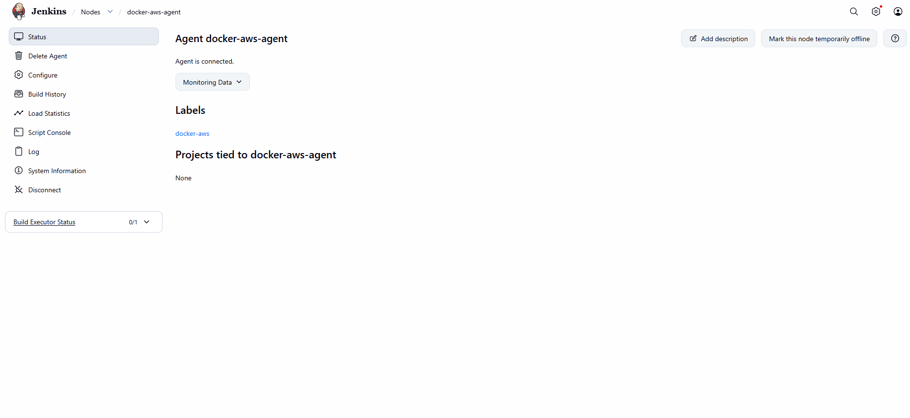
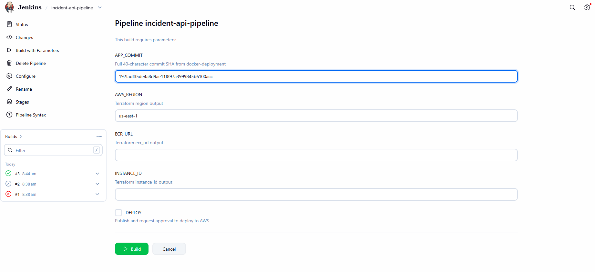
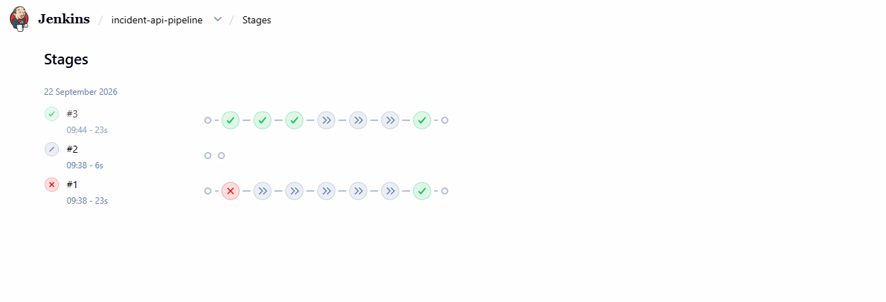
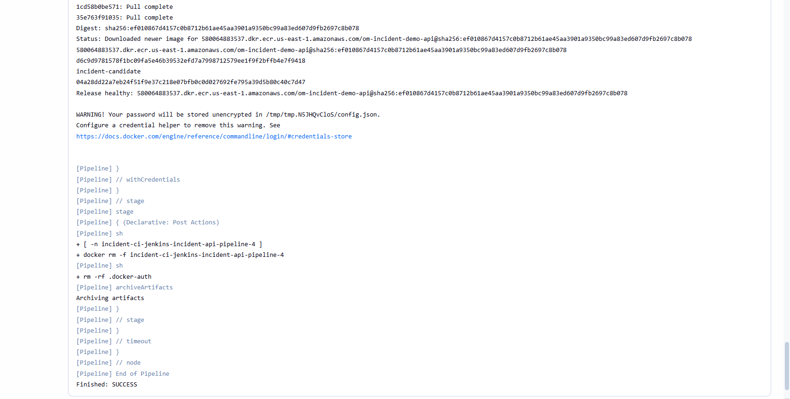
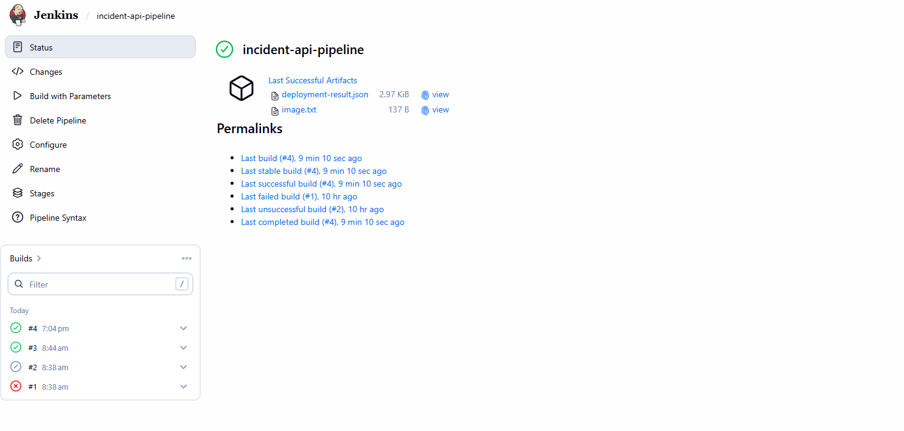
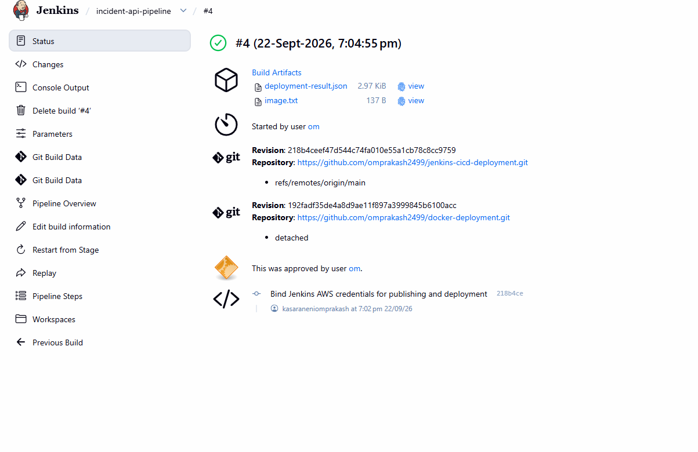
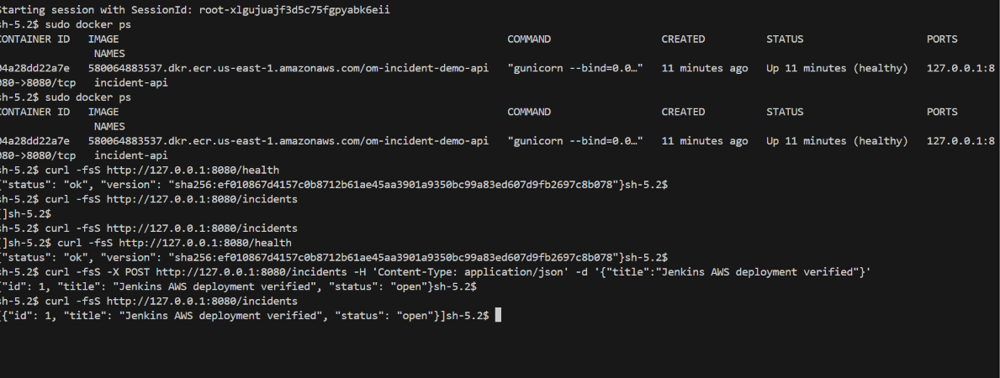

# Screenshot evidence

Original screenshots from the verified runs. Numbering preserves the capture labels;
missing numbers represent screenshots that were not supplied.

## Connected Jenkins agent

## CI parameters with deployment disabled

## Build #3 CI stages; AWS stages skipped

## Build #4 healthy AWS release and SUCCESS

## Archived image and deployment result

## Build #4 approval and source revisions

## Healthy EC2 container and API create/list checks

