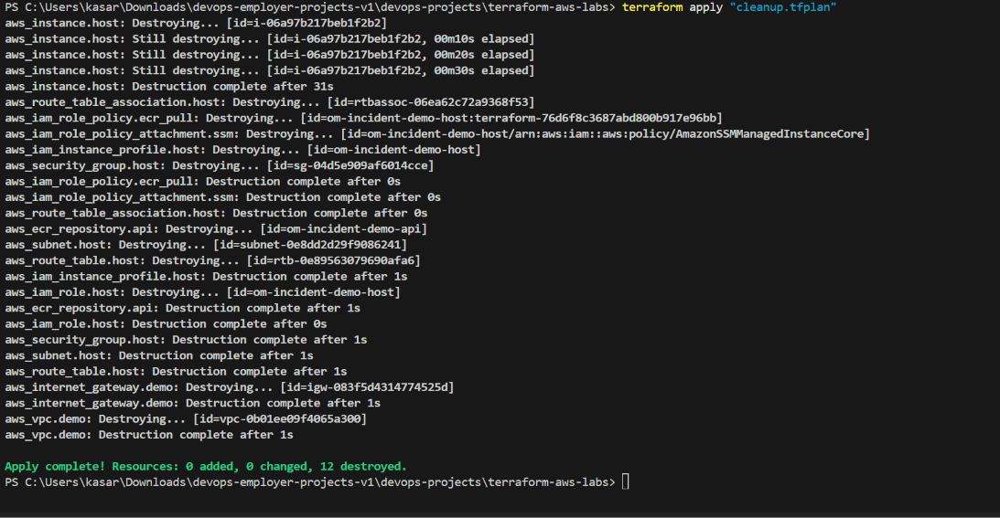

# Validation record

## Verified Jenkins and AWS execution

Jenkins job: `incident-api-pipeline`. Release build: **#4**, result **SUCCESS**.
Evidence consists of the actual Jenkins console output and uploaded screenshots.

| Check | Result |
| --- | --- |
| Inbound agent connected with label docker-aws | PASS |
| Application checkout pinned to full commit SHA | PASS |
| Nine application unit tests | PASS in build #4 (0.093 seconds) |
| Linux amd64 Docker image build | PASS |
| Container health and incident-list smoke test | PASS |
| Scoped Jenkins credential binding and ECR login | PASS |
| Immutable image tag published to ECR | PASS |
| Manual release approval | PASS |
| SSM deployment and target image pull by digest | PASS |
| Candidate check and final release health | PASS |
| EC2 container status | Healthy |
| Direct EC2 GET /health | status=ok; version matches release digest |
| Direct EC2 POST /incidents | Created incident #1, status=open |
| Direct EC2 GET /incidents | Returned incident #1 |
| Jenkins test-container and Docker-auth cleanup | PASS in console |
| image.txt and deployment-result.json archived | PASS |

## Release identity

- Pipeline commit: `218b4ceef47d544c74fa010e55a1cb78c8cc9759`
- Application commit: `192fadf35de4a8d9ae11f897a3999845b6100acc`
- Image tag: `192fadf35de4a8d9ae11f897a3999845b6100acc-4`
- Image digest: `sha256:ef010867d4157c0b8712b61ae45aa3901a9350bc99a83ed607d9fb2697c8b078`
- AWS region: `us-east-1`
- Test incident title: `Jenkins AWS deployment verified`

## Earlier CI run

Build #1 rejected an empty APP_COMMIT before application tests.
Build #3 passed all nine tests and Docker build/smoke checks with DEPLOY disabled;
publish, approval and deployment stages were correctly skipped.

The nine tests cover invalid JSON, explicit connection closure, incident lifecycle
and persistence, database-aware health, invalid titles, oversized requests,
media type, missing routes/IDs, and SQL input handling.

## Evidence and limits

See the [screenshot gallery](screenshots/README.md). The CI stage screenshot is
from build #3. Build #4 is evidenced by its summary, console and archived-artifact
screenshots; direct runtime behavior is shown in the EC2 screenshot.

Not yet verified: failed-release rollback, automatic restoration after a failed
switch, AWS container replacement/reboot persistence, backup/restore, or deletion of the separately created deployment credentials. The successful incident readback does not prove restart persistence.
The deployment uses a single EC2 host and may incur a short outage during replacement.
No availability or cost-reduction measurements are claimed.

## Terraform cleanup verified

After emptying the ECR repository, the saved destroy plan was applied successfully:
`Apply complete! Resources: 0 added, 0 changed, 12 destroyed.`
The EC2 instance, ECR repository, project networking, and Terraform-managed host IAM
resources were destroyed. The demo database was on the deleted instance volume.
Deletion of the separately created Jenkins IAM access key and Jenkins credential
has not yet been confirmed. This is project cleanup evidence, not an account-wide
billing or resource audit.

